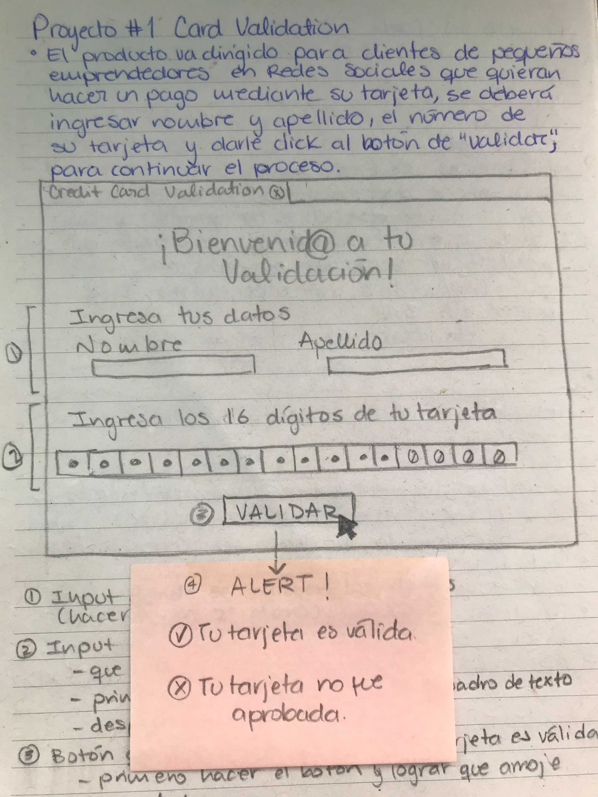
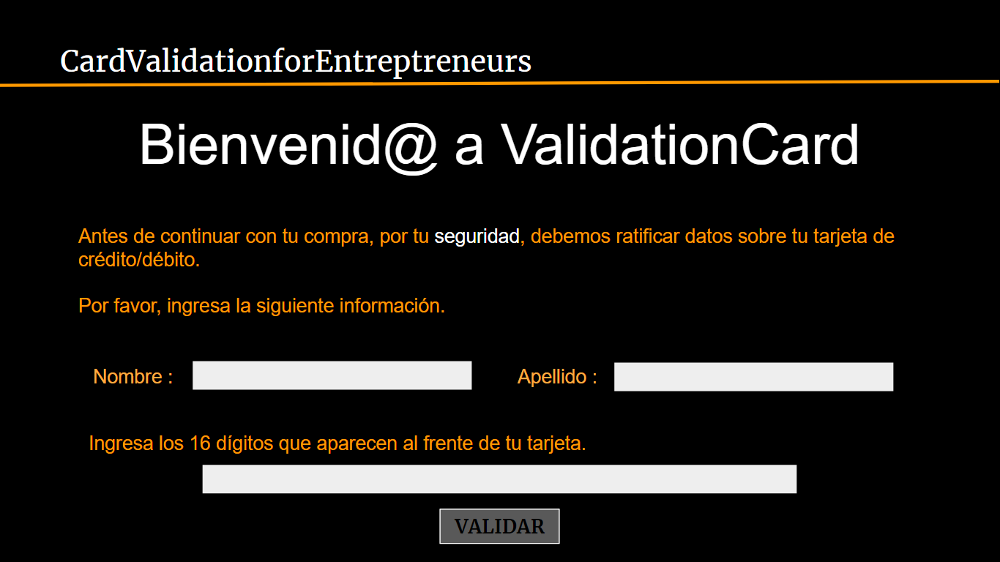
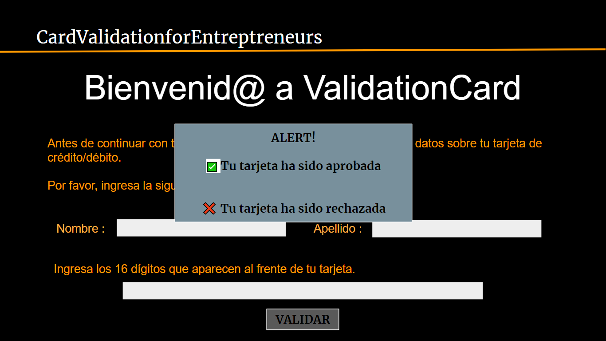
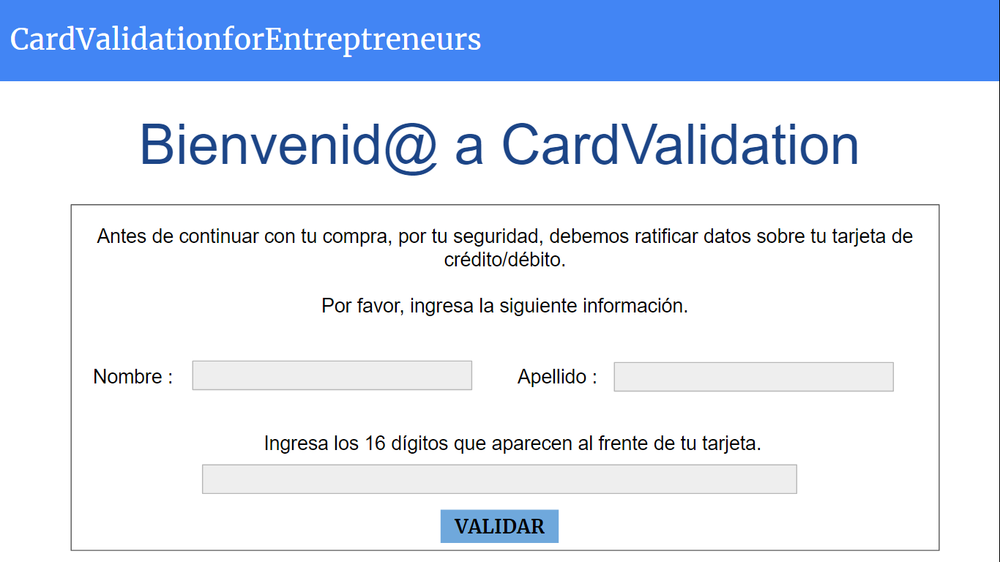
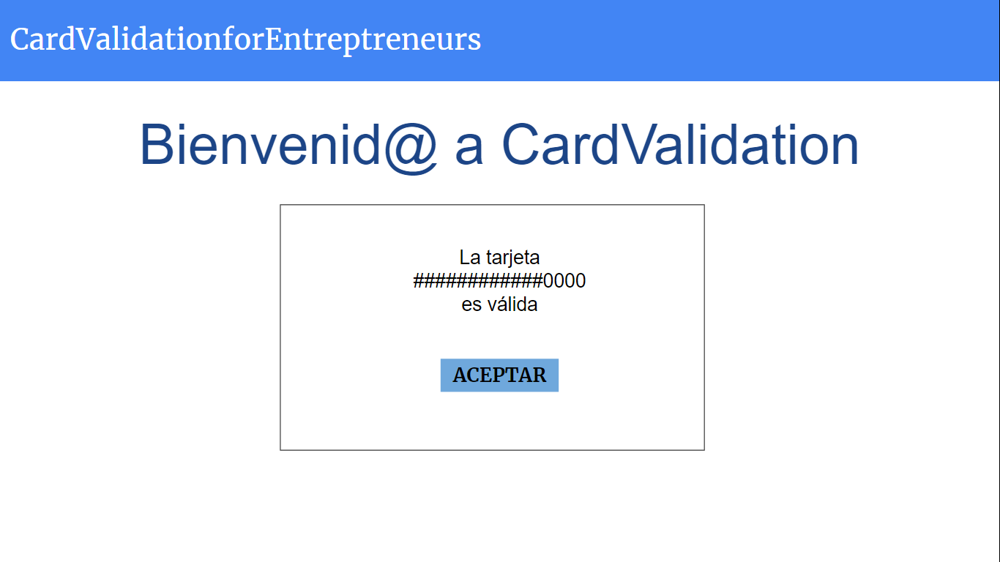
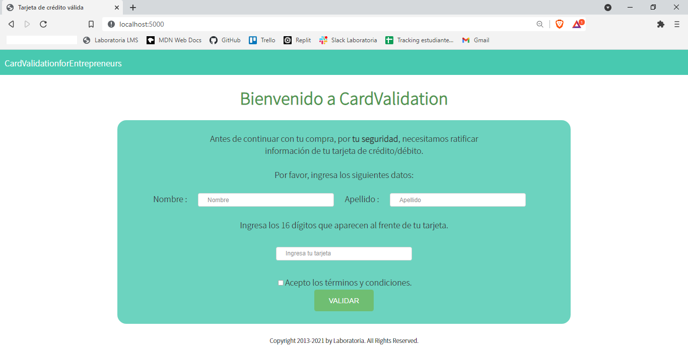
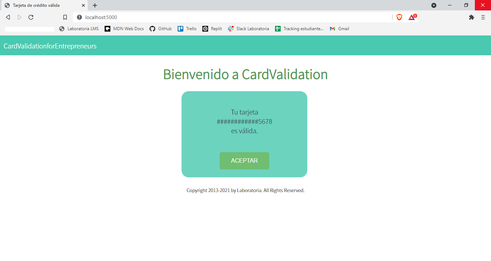

# Tarjeta de crédito válida

## 1. Título : "Card Vaidation for Entrepreneurs"

Página web que ayuda a la validación de tarjetas de crédito usando el algoritmo de Luhn, para que los pequeños empredendores reciban el pago de sus productos y no sean víctimas de fraudes.

## 2. Resumen del proyecto

El producto va dirigido para los pequeños emprendedores de redes sociales que tienen una opción de pago con tarjeta de crédito. Para evitar el ingreso de tarjetas no válidas, antes de realizar el pago se comprueban los datos de la tarjeta en la página de validación, de no ser aceptada, se procedará con otro método de pago del producto deseado.
Consiste en una interfaz sencilla que solicita pocos datos y da una respuesta corta y directa, únicamente se introducen datos personales como el nombre y apellido de la persona, al igual que los dígitos de la tarjeta y estos datos no son almacenados para la seguridad del cliente. 

* Primer prototipo en papel:

* Primer prototipo con ayuda de Google Slides: 

El feedback consistió en mejorar el diseño de la interfaz, ya que los colores seleccionados no eran adecuados, y la distribución dentro de la página estaba muy saturada. En vez de arrojar alertas, se desarrollaría otra pantalla donde se mostraría el resultado de la validación.

* El segundo prototipo del producto: 

Se mejoró el CSS y la distribución, de igual manera, en el producto final se añadió el footer.

* Maquetación del producto: 

## 3. Objetivos de aprendizaje

Los objetivos que se priorizaron durante la elbaoración de la página web, fueron los encaminados a la funcionalidad, sin embargo, como primer paso fue la planeación del producto.

* La elaboración de la función  "isValid" donde se desarrollaría la lógica del algoritmo de Luhn, la separación del string, revertir su orden, la ubicación y duplicación de los elementos en posiciones, en caso de ser necesario su reducción para solo tener dígitos de 0-9 y por último la suma de todos los elementos, en caso de ser múltiplo de 10 este sería un número de tarjeta válida. 

* También la aplicación de la función "maskify" donde se ocultarían los dígitos de la tarjeta excepto por los útimos 4 para mantener resguardada la información de los usuarios.

* Por último se enfatizó el diseño de la interfaz, de una manera que fuera sencilla y amigable para los usuarios y no resultara tedioso el uso de la página web.
1. Se intruduce el nombre y el apellido del propietario de la tarjeta.
2. Se introducen los dígitos de la tarjeta de crédito.
3. Se aceptan las condiciones de uso.
4. Se da click en el votón de "Validar".
5. Aparece la pantalla con el resultado de validación.
6. Por último el botón de "Aceptar" regresa a la pantalla de inicio.

## Checklist

### Parte Obligatoria

* [x] `README.md` incluye info sobre proceso y decisiones de diseño.
* [x] `README.md` explica claramente quiénes son los usuarios y su relación con
  el producto.
* [ ] `README.md` explica claramente cómo el producto soluciona los
  problemas/necesidades de los usuarios.
* [x] `README.md` (o otro archivo) contiene tu plan de acción - Objetivos que prioritizaste este proyecto.
* [x] Usa VanillaJS.
* [x] No utiliza `this`.
* [x] Implementa `validator.isValid`.
* [x] Implementa `validator.maskify`.
* [x] Pasa linter con configuración provista.
* [x] Pasa pruebas unitarias.
* [x] Pruebas unitarias cubren 70% de _statements_, _functions_ y _lines_, y un
  mínimo del 50% de _branches_.
* [x] Interfaz permite escribir un número para ser validado.
* [x] Interfaz muestra el resultado de la validación correctamente.
* [x] Interfaz oculta todos los números escritos excepto los 4 últimos

### Parte Opcional: "Hacker edition"

* [ ] Implementa `validator.getIssuer`.
* [ ] Interfaz muestra la franquicia de la tarjeta
